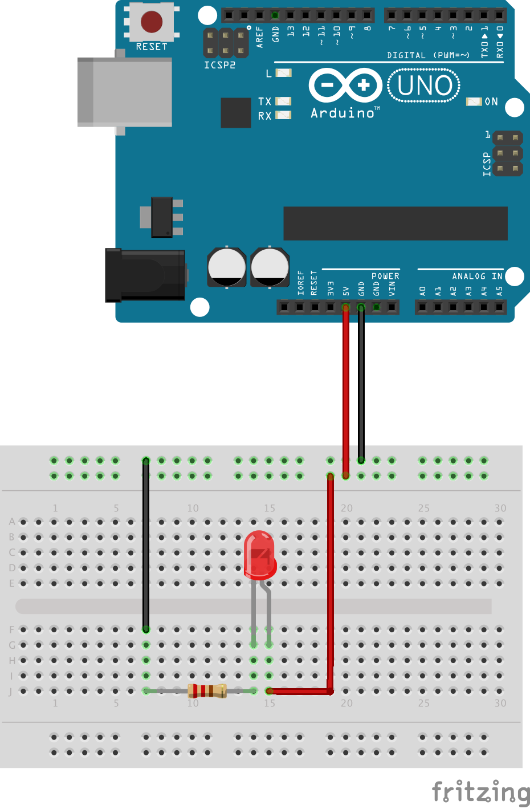

# LED

The wiring shown below will make the LED (Light Emitting Diode) light up. The Arduino is only used as
a power supply. No program (so-called _sketch_) needs to be uploaded to the Arduino for this tutorial.
Note that the Arduino still needs to be connected via a USB cable in order to provide it with power.
The 220 Ohm resistor (color code: red-red-brown) is needed to limit the current
through the LED in order to avoid it from burning out. The polarity of the LED is important. The longer
lead is called *anode* and needs to be connected to the positive voltage while the short lead
(called *cathode*) needs to be connected towards ground. If the LED is connected in reverse the LED
will not light up.

Tutorial [link](https://www.youtube.com/watch?v=GcfJXjz86n0&list=PL2prrfB4uRarl12GHSbsoMmeYYlk2PLb7&t=4s&index=4)
