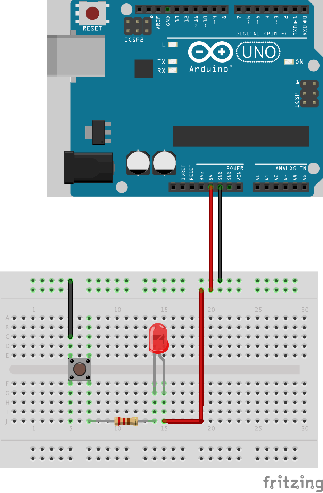

# LED & Button

The wiring shown below combines a button with a LED. The LED will light up when the button is pressed.
The Arduino is only used as a power supply. No sketch needs to be uploaded. The 220 Ohm resistor is needed
to limit the current through the LED in order to avoid it from burning out. The polarity of the LED is
important. The longer lead is called *anode* and needs to be connected to the positive voltage while the short lead
(called *cathode*) needs to be connected towards ground. If the LED is connected in reverse the LED
will not light up.

