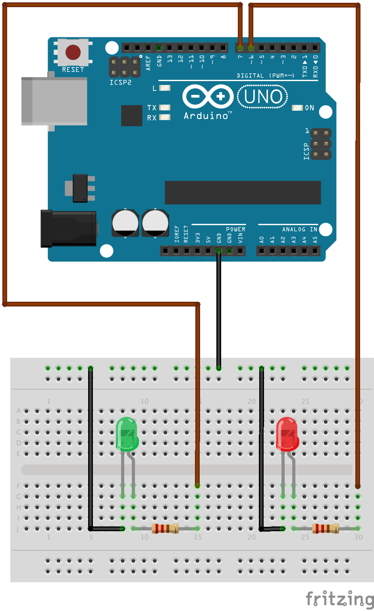

# Two Blinking LEDs

The Arduino has only one thread of execution. Sketches need to be specially designed to support concurrent
operations. Function <a href="https://www.arduino.cc/en/Reference/Delay">`delay()`</a> has the side-effect
that it blocks execution and it is not possible to have the Arduino do something else in the meantime.
An <a href="../04">earlier example</a> showed how time delays can be accomplished with the help of
function <a href="https://www.arduino.cc/en/Reference/Millis">`millis()`</a>. The following sketch shows how
a C++ class can be used to encapsulate time-based behavior for easier reuse. The sketch makes two LEDs
blink in different patterns and demonstrates quasi-concurrency with only one thread of execution:

```c++
class BlinkingLED {
private:
  const int LED_PIN;
  const int LED_ON_TIME;
  const int LED_OFF_TIME;
  int ledState = LOW;
  unsigned long tsLastStateChange = 0;
public:
  BlinkingLED(int pin, int onTime, int offTime) :
    LED_PIN(pin),
    LED_ON_TIME(onTime),
    LED_OFF_TIME(offTime) {
      pinMode(LED_PIN, OUTPUT);
  }
  void update() {
    unsigned long delta = millis() - tsLastStateChange;
    switch(ledState) {
    case LOW:
      if (delta > LED_OFF_TIME) {
        ledState = HIGH;
        tsLastStateChange = millis();
      }
      break;
    case HIGH:
      if (delta > LED_ON_TIME) {
        ledState = LOW;
        tsLastStateChange = millis();
      }
      break;
    }
    digitalWrite(LED_PIN, ledState);
  }
};

BlinkingLED ledRed(6, 50, 25);
BlinkingLED ledGreen(7, 100, 100);

void setup() {}

void loop()
{
  ledRed.update();
  ledGreen.update();
}
```



