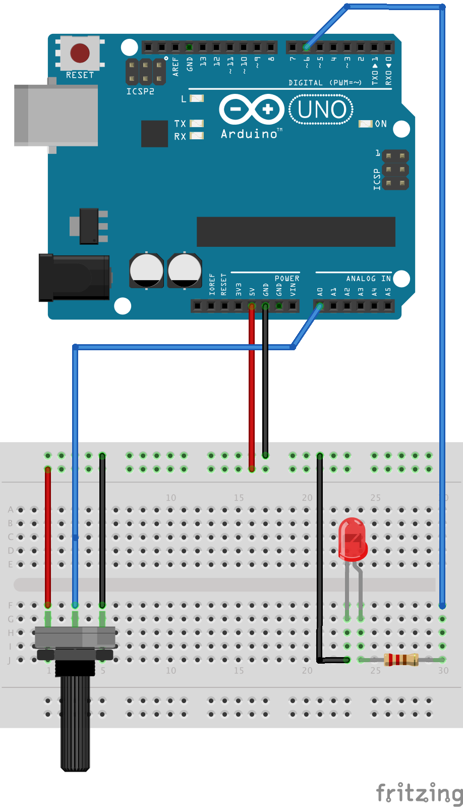

# Analog Signals

The Arduino features 10-bit analog-to-digital converters that are available on the Uno via pins A0 to
A5. Function
<a href="https://www.arduino.cc/en/Reference/AnalogRead">`analogRead()`</a>
converts input voltages between 0V and 5V to integer values 0 through 1023. In the wiring diagram below, a
potentiometer (i.e., a variable resistor) acts as a voltage divider. The input voltage of analog
pin A0 can be controlled by turning the potentiometer.

The Arduino has no corresponding digital-to-analog converter. Instead, the Arduino uses what is called
<a href="https://www.arduino.cc/en/Tutorial/PWM">_Pulse Width Modulation_</a>, or PWM for short.
In PWM, a digital signal is used to fake an analog signal. This is achieved by quickly alternating
a digital signal between 0V (LOW) and 5V (HIGH) at a high frequency in such a pattern that it appears
as an analog signal. The _duty cycle_ determines the percentage of the time the signal is HIGH. E.g.,
a duty cycle of 25% indicates that the signal is on the average 25% HIGH and 75% LOW.


Function
<a href="https://www.arduino.cc/en/Reference/AnalogWrite">`analogWrite()`</a>
can be used to generate a PWM signal. Note that only pins that are prefixed with a "~" can be used
with PWM. The sketch below reads an analog value from pin A0 and then generates a PWM signal on pin 6.
The brightness of the LED can be controlled by adjusting the potentiometer.

```c
const int PIN_LED = 6;
const int PIN_POTENTIOMETER = A0;

void setup() {
  pinMode(PIN_LED, OUTPUT);
}

void loop() {
  // val will be between 0 and 1023
  int val = analogRead(PIN_POTENTIOMETER);
  // (val / 4) will be between 0 and 255
  analogWrite(PIN_LED, val / 4);
}
```



