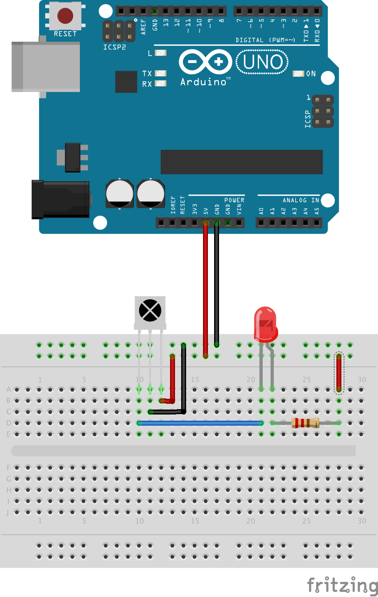

# Infrared Receiver

An _Infrared Receiver_ (IR receiver for short) detects  infrared light modulated at a certain frequency,
commonly 38 kHz. Whenever this frequency of the IR spectrum is detected, the output pin of the IR receiver
is asserted to low (leftmost pin of the IR receiver in the diagram below).
When a regular TV remote is pointed to the IR receiver below, the red LED will light
up. One of the reasons the IR signal is modulated at 38 kHz is so that the IR receiver can distinguish it from
naturally occuring infrared light (e.g., the sun). Each button of a TV remote sends an unique on/off pattern that
identifies the particular button. An oscilloscope or a logic analyzer are needed to visualize this pattern.
The Arduino is once more only used as a power supply in this example and no sketch needs to be uploaded.

A good explanation on the functioning of an IR receiver is contained
at this <a href="https://learn.adafruit.com/ir-sensor/overview">Adafruit tutorial</a>. This
<a href="http://irq5.io/2012/07/27/infrared-remote-control-protocols-part-1/">web page</a> provides
a good explanation of the various encodings used for IR signals.

