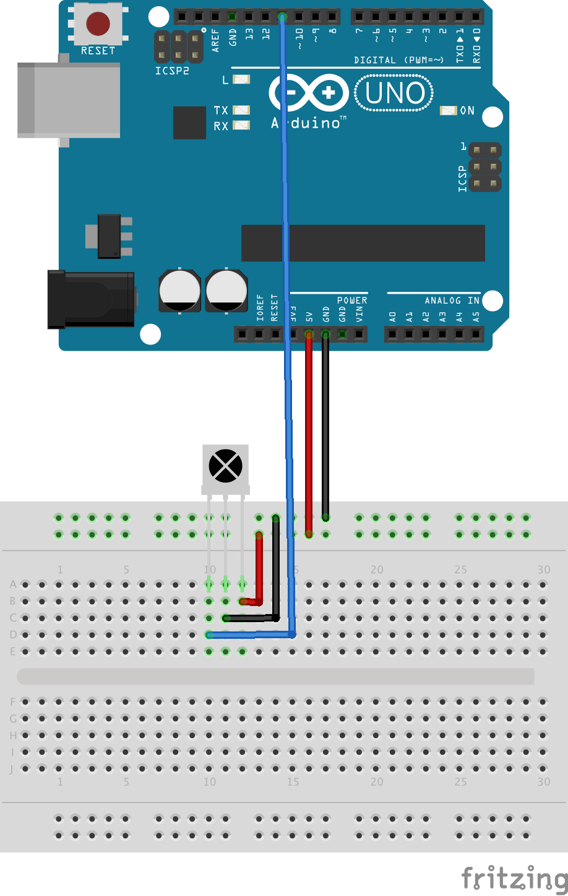
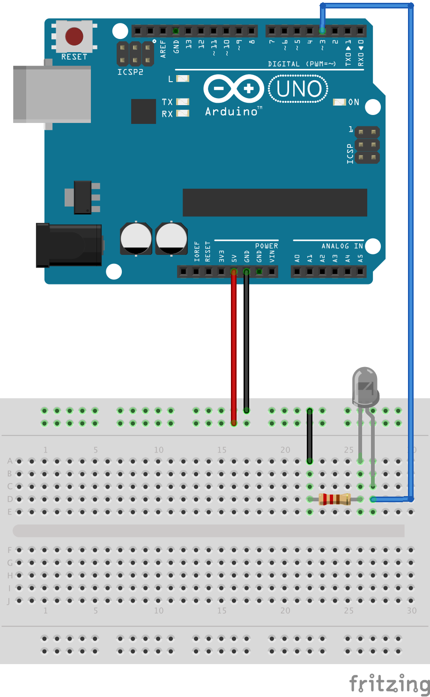

# Sending &amp; Receiving IR Signals

This example demonstrates how an Arduino can be used to receive and send IR signals. The sketches featured in
this section make use of a library called
<a href="https://github.com/z3t0/Arduino-IRremote">IRremote</a> that takes care of the heavy lifting of modulating
and un-modulating the 38 kHz carrier. The IRremote library can easily be downloaded and installed via the Arduino IDE.
First select the menu option _Sketch > Include Library > Manage Libraries..._. Then search for "_IRremote_" and click on
the "_Install_" button. The IRremote library can now be used in sketches by including the header file
`#include <IRremote.h>`. The following two sections discuss receiving and sending of IR signals.

### Receiving

For the first example the same IR receiver will be used as in the
<a href="../09/">previous example</a>. This time, however, the output pin of the IR receiver is connected to
the Arduino's GPIO pin 11 as shown in the wiring diagram below.



Sketch
<a href="IRReceiver/IRReceiver.ino">IRReceiver</a> uses the IRremote library to print out the high/low pattern
of an IR signal. The following is the complete sketch of
<a href="IRReceiver/IRReceiver.ino">IRReceiver</a>:

```c
#include <IRremote.h>

const int PIN_IR_RECEIVER = 11; 

IRrecv ir_receiver(PIN_IR_RECEIVER);

decode_results results;

void setup() {
  Serial.begin(9600);
  ir_receiver.enableIRIn();
}


void dump(decode_results& results) {
  Serial.print("// Value: ");
  Serial.println(results.value, HEX);
  Serial.print("unsigned int rawData[] = {");

  for (int i = 1;  i < results.rawlen;  i++) {
    if (i != 1) {
      Serial.print(", ");
    }
    Serial.print(results.rawbuf[i] * USECPERTICK, DEC);
  }
  Serial.println("};");
}

void loop() {
  if (ir_receiver.decode(&results)) {
    dump(results);
    ir_receiver.resume();
  }
}
```

Whenever an IR signal is detected, function `dump()` is called to print out the on/off pattern. For example,
pressing the on/off button of a Samsung TV remote will result in the following output in the serial monitor:

```c
// Value: E0E040BF
unsigned int rawData[] = {4500, 4450, 600, 1600, 600, 1600, 600, 1650, 600, 500, 600, 500, 600, 500, 600, 500, 650, 500, 600, 1600, 600, 1600, 600, 1650, 600, 500, 600, 500, 600, 500, 600, 550, 600, 500, 600, 500, 600, 1600, 600, 500, 600, 550, 600, 500, 600, 500, 600, 500, 600, 500, 600, 1650, 600, 500, 600, 1600, 600, 1650, 600, 1600, 600, 1600, 600, 1650, 600, 1600, 600};
```

The way the sketch is written, it will print out the on/off pattern as a C-array to the serial monitor so that
it can be easily copy-and-pasted. The numbers represent micro-seconds, e.g., the first 4500 means that the
signal goes low for 4500 micro-seconds (or 4.5 milli-seconds or 0.0045 seconds). The next number 4450 then
means the IR signal went high for 4450 micro-seconds, etc. Using a logic analyzer, the sequence of numbers
representing high and low pattern can be visualized:


Note that when repeating this experiment, the numbers will be slightly different because of small variations
in the overall timing. The Samsung TV remote uses
<a href="http://irq5.io/2012/07/27/infrared-remote-control-protocols-part-1/">_Pulse Distance Coding_</a>
to encode a binary value in the IR signal it sends. Translating the signal captured above by the logic analyzer
results in the binary value 11100000111000000100000010111111b,
or 0xE0E040BF in hexadecimal. As shown above, this corresponds with what the
<a href="IRReceiver/IRReceiver.ino">IRReceiver</a> sketch will print to the serial monitor.


### Sending

The second sketch uses an IR diode to send and IR signal. The wiring is as follows:



Similar to regular LEDs used to far, attention needs to be paid to the polarity of the IR diode as well
as a protective resistor. The IR diode is connected to GPIO pin 3. Note that there is no way to configure
to which GPIO pin the IR diode is connected. The IRremote library expects it to be connected to pin 3.

The sketch below uses method `sendRaw()` of the IRremote library to send the on/off pattern. Note that the numbers
are identical to the pattern shown above. Since this pattern represents the on/off switch of a Samsung TV remote,
the sketch below will turn a Samsung TV repeatedly on and off in 5 second intervals when the IR diode is pointed
to the TV.

```c
#include <IRremote.h>

const int frequency = 38; // 38 kHz carrier frequency

IRsend ir_sender;

unsigned int rawData[] = {4500, 4450, 600, 1600, 600, 1600, 600, 1650, 600, 500, 600, 500, 600, 500, 600, 500, 650, 500, 600, 1600, 600, 1600, 600, 1650, 600, 500, 600, 500, 600, 500, 600, 550, 600, 500, 600, 500, 600, 1600, 600, 500, 600, 550, 600, 500, 600, 500, 600, 500, 600, 500, 600, 1650, 600, 500, 600, 1600, 600, 1650, 600, 1600, 600, 1600, 600, 1650, 600, 1600, 600};

void setup() {
}

void loop() {
  ir_sender.sendRaw(rawData, sizeof(rawData) / sizeof(rawData[0]), frequency);
  delay(5000);
}
```

