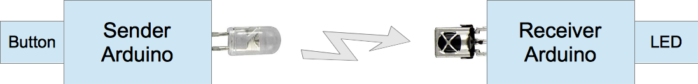

# Infrared Remote Communication

As an extension to the previous example, a pair of IR receiver and IR LED is used to send a signal between
two Arduinos. The figure below depicts the overall architecture. The sending Arduino has a button and an IR LED,
while the receiving Arduino is connected to an IR receiver and a regular LED. Pressing the button will cause an IR
signal with a certain pattern to be sent from the sending Arduino's IR LED. The receiving Arduino will flash
the regular LED whenever the IR receiver picks up that particular IR signal. Infrared in this example is used
to communicate a simple on/off signal between the two Arduinos.



On the sender side, the wiring is as follows:


The sketch that runs on the sender's Arduino will send a specific IR pattern whenever the button is pressed:

```c
#include <IRremote.h>

const int PIN_BUTTON = 7;
const int frequency = 38;

IRsend ir_sender;

const unsigned int rawData[] = {1000, 1000, 1000, 500, 1000, 500, 1000, 500, 1500, 1000, 500, 500, 1500, 1000};

void setup() {
  pinMode(PIN_BUTTON, INPUT_PULLUP);
}

void loop() {
  bool pressed = digitalRead(PIN_BUTTON) == LOW;
  if (pressed) {
    ir_sender.sendRaw(rawData, sizeof(rawData) / sizeof(rawData[0]), frequency);
    delay(1000);
  }
}
```

The on/off pattern encoded in the `rawData[]` C-array does not correspond to any known TV remote encoding
and is simply a random sequence of the values 1000 and 500 (those values again represent micro-seconds).

The receiver's Arduino uses the following wiring:


Besides the IR receiver, the wiring shows a LED connected to GPIO pin 2. The red LED will light up whenever
the sender pushes the button on the remote Arduino. Both Arduinos must be within line of sight (IR light does
not travel through walls). Furthermore for best effect, the IR diode should be pointing to the IR receiver.

The sketch below runs on the receiver's Arduino. First notice that the `rawData[]` C-array has the same
sequence of numbers as used in the sender. After all, sender and receiver need to be in agreement on the
specific on/off pattern used. What makes the receiver sightly more complicated is the timing issue:
as explained in an earlier tutorial, the timings of the on/off pattern will be slightly different each
time the IR signal is received. To account for that, function `analyze()` allows for small variations
in the timing expressed by the global variable `sensitivity`. The sensitivity of 150 micro-seconds means
that when the on/off value of 1000 micro-seconds is expected (as is in the first value of the
`rawData[]` C-array), the receiver will accept when the actual time is between 850 and 1150 micro-seconds.

```c
#include <IRremote.h>

const int PIN_IR_RECEIVER = 11; 
const int PIN_LED = 2;

const int sensitivity = 150;

const unsigned int rawData[] = {1000, 1000, 1000, 500, 1000, 500, 1000, 500, 1500, 1000, 500, 500, 1500, 1000};

IRrecv ir_receiver(PIN_IR_RECEIVER);

decode_results results;

void setup() {
  pinMode(PIN_LED, OUTPUT);
  ir_receiver.enableIRIn();
}

void alarmRaised() {
  digitalWrite(PIN_LED, HIGH);
  delay(2000);
  digitalWrite(PIN_LED, LOW);
}

bool analyze(decode_results* results) {
  int len = sizeof(rawData) / sizeof(rawData[0]);
  if (len != results->rawlen) {
    return false;
  }
  for (int i = 1; i < len; i++) {
    unsigned int v = results->rawbuf[i] * USECPERTICK;
    unsigned int ref = rawData[i - 1];
    if (v < ref - sensitivity) {
      return false;
    }
    if (v > ref + sensitivity) {
      return false;
    }
  }
  return true;
}

void loop() {
  if (ir_receiver.decode(&results)) {
    if (analyze(&results)) {
      alarmRaised();
    }
    ir_receiver.resume();
  }
}
```

