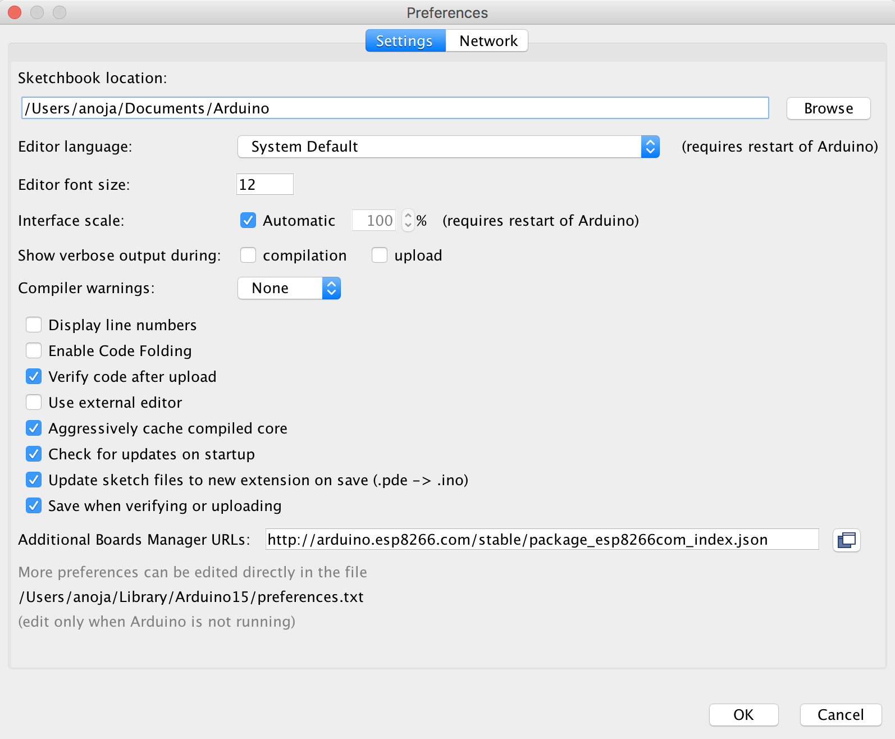
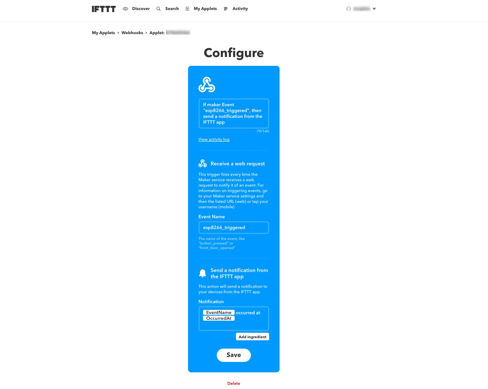
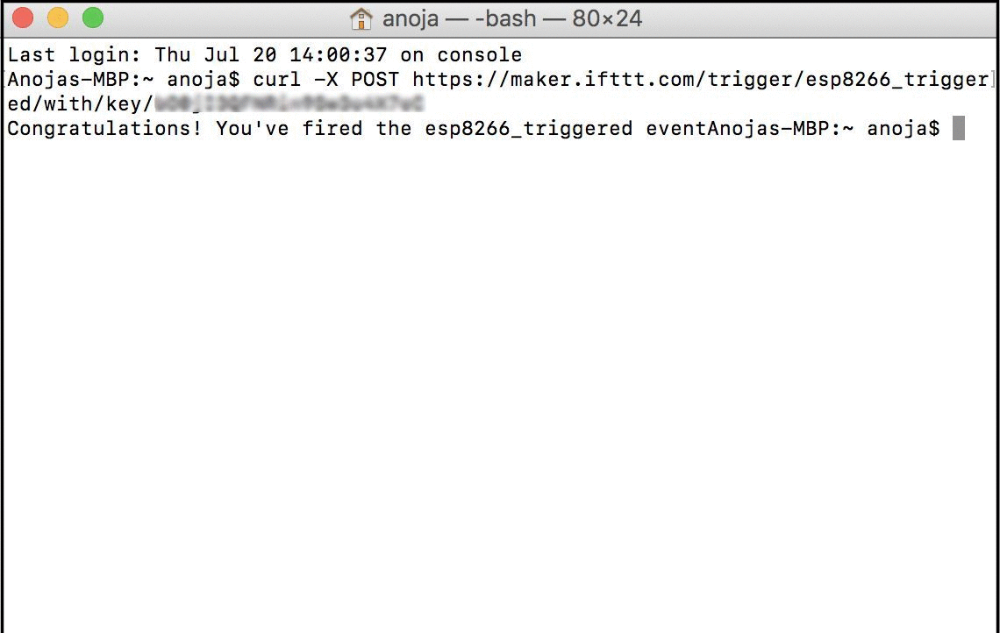

# IoT &amp; Cloud

The Arduino Uno used so far in this tutorial does not have WiFi capabilities and therefore cannot connect
to the Internet. The following example uses a different microcontroller: the ESP8266. This microcontroller
features a WiFi module that allows it to connect to the Internet and to communicate with remote servers. This
tutorial uses a service called IFTTT. IFTTT is a free web-based cloud service used to create chains of simple
conditional statements. The IFTTT service is popular among home automation and DIY projects.
IFTTT also offers free Android and iOS apps for download that are used in this tutorial. The diagram below
depicts the overall architecture:


The ESP8266 uses its built-in WiFi module to connect to a local WiFi router. The sketch running on the
ESP8266 performs an HTTP POST request to a remote IFTTT server. That POST request contains a unique key
that identifies a specific user. IFTTT uses this key to send a push-notification to the user's mobile
device. The benefit of using IFTTT is that it requires no programming on the server- or mobile-side.
Programming the ESP8266 is more complicated than programming an Arduino Uno. The following sections
discuss the complete setup step-by-step.

### ESP8266 Programmer

The ESP8266 does not have an USB interface. In order to flash compiled sketches to the ESP8266, a so-called
FTDI cable needs to be used that converts USB to a serial signal. The ESP8266 is connected to the RXD/TXD
(receive/transmit) pins of the FTDI cable. The following diagram shows the pinout of the ESP8266:


The following wiring shows how the FTDI cable is connected to the ESP8266:


The wiring features two buttons: a reset and a flash button. The reset button causes the ESP8266 to reboot.
The flash button is connected to GPIO pin 0. When the ESP8266 reboots, it will enter flashing mode when this pin
is asserted to low. In order to flash a new sketch to the ESP8266, the following procedure is necessary:
keep the flash button pressed while pressing the reset button. Both buttons can be released then. Once the
ESP8266 is in flashing mode, a new sketch can be uploaded via the Arduino IDE.


### Arduino IDE

The standard Arduino IDE can be used to program and upload a sketch to the ESP8266. To add support for the
ESP8266, the following needs to be done once:

* In the Arduino IDE, go to the _Preferences_ dialog.
* In the "_Additional Board Manager URLs_" field, enter the following URL:
  `http://arduino.esp8266.com/stable/package_esp8266com_index.json`. Multiple URLs in that field need to
  be comma-separated.<br/>
  <a href="doc/Preferences.png"></a>
* After clicking _OK_, go to _Tools > Board > Boards Manager_.<br/>
  <a href="doc/Board%20Manager.png"></a> 
* Scroll down, select and install the "_esp8266_" platform published by the ESP8266 Community.
* Select board _Tools > Board > Generic ESP8266 Module_. Note that no programmer needs to be selected.
* Select port _Tools > Port_. It might be necessary to install a USB driver to recognize the FTDI cable which
  is available at <a href="https://www.silabs.com/products/development-tools/software/usb-to-uart-bridge-vcp-drivers">silabs.com</a>.<br/>
  <a href="doc/Port%20Setting.jpg"></a>

### IFTTT

In order to use IFTTT, a user account with some additional setup is required. The IFTTT web interface is
powerful, but also not always intuitive to use. The following is a step-by-step instruction on the
required setup:

* Create an account at <a href="https://ifttt.com">IFTTT.com</a>
* <a href="https://ifttt.com/create/connect-maker_webhooks?sid=1">Connect to Webhooks</a>. Click on "_Connect_".
* On the next page click on "_Receive a web request_".
* Enter "_esp8266_triggered_" as the Event Name. Click on "_Create trigger_".<br/>
  <a href="doc/App%20Created.jpg"></a>
* Click on "_that_"
* On the "_Choose action service_" search for "_Notification_" service. Click on "_Notifications_".
* Click on "_Connect_" on the next page.
* Click on "_Send a notification from the IFTTT app_" on the next page.
* In the text box "_Notification_" replace the text with the following:
  `{{EventName}} occurred at {{OccurredAt}}`
* Click on "_Create action_"
* On the next page click "_Finish_".<br/>
  <a href="doc/Configure.jpg"> </a>
* Go to the <a href="https://ifttt.com/services/maker_webhooks/settings">Webhook Settings</a> page.
* On that page there is a URL that begins with `https://maker.ifttt.com/use/`. What follows in the URL is
  the IFTTT API key. The API key identifies the user who created that key.  In the following this key is
  referred to as `API_KEY`.
* If you are running on a Unix system you can now try to trigger an event from the command line via:
  ```
  curl -X POST https://maker.ifttt.com/trigger/esp8266_triggered/with/key/API_KEY
  ``` 
The `curl` command will issue an HTTPS request to the given URL. The IFTTT server identifies a user by the
`API_KEY` and will send a push notification to the user's mobile device. For this to happen, the user must
have installed the (free) IFTTT app for Android or iOS and be logged in to IFTTT on the mobile device.<br/>
<a href="doc/Terminal.png"> </a>


### ESP8266 Sketch

The
<a href="ESP8266_IFTTT/ESP8266_IFTTT.ino">ESP8266_IFTTT</a>
sketch is printed in its entirety below and demonstrated how to perform the POST request to the
IFTTT server. Conceptually, the sketch does the same as the `curl` script mentioned above. Whenever the
flash button is pressed, the ESP8266 will perform a POST request and thereby trigger a push-notification
to the user's mobile device. Note that the flash button is connected to GPIO pin 0 and can therefore be
used as input in any sketch.

There are three variables in the sketch below that need to be customized before compiling and uploading
to the ESP8266:

* `ssid`: the SSID of the WiFi network that the ESP8266 should connect to.
* `password`: the WiFi password.
* `iftttApiKey`: the IFTTT `API_KEY` as explained in the previous section.

The sketch first connects to the configured WiFi in `setup()` and setups up pin 0 as input. The
`loop()` function checks if the button attached to pin 0 (the flash button) is pressed and will
then call function `doPOST()` to perform the actual POST request to the IFTTT server. Note that the
sketch does not use a dedicated HTTP library. The sketch communicates to the IFTTT server by using
a plain TCP connection and by sending the
<a href="https://en.wikipedia.org/wiki/Hypertext_Transfer_Protocol#Message_format">HTTP protocol</a>
that is constructed via method `client.print()`.<br/>
<a href="doc/Arduino%20Terminal.png"> </a>
 

```c
#include <ESP8266WiFi.h>
#include <WiFiClientSecure.h>

// The following three parameters need to be changed
const char* ssid = "IoT Workshop";
const char* password = "B9LZd73yWx33";
const char* iftttApiKey = "API_KEY";

const char* host = "maker.ifttt.com";
const int httpsPort = 443;

const int PIN_BUTTON = 0;

void setup() {
  Serial.begin(115200);

  WiFi.begin(ssid, password);
  while (WiFi.status() != WL_CONNECTED) {
    delay(500);
  }
  Serial.print("WiFi connected with IP address: ");
  Serial.println(WiFi.localIP());

  pinMode(PIN_BUTTON, INPUT_PULLUP);
}

void doPOST() {
  WiFiClientSecure client;
  Serial.println("Connecting to IFTTT server");
  if (!client.connect(host, httpsPort)) {
    Serial.println("Connection failed");
    return;
  }

  String url = "/trigger/esp8266_triggered/with/key/";
  client.print(String("POST ") + url + iftttApiKey + " HTTP/1.1\r\n" +
               "Host: " + host + "\r\n" +
               "User-Agent: ESP8266\r\n" +
               "Connection: close\r\n\r\n");

  while (client.connected()) {
    // Read response from IFTTT but ignore it
    String line = client.readStringUntil('\n');
    Serial.println(line);
  }
}

bool isButtonPressed() {
  return digitalRead(PIN_BUTTON) == LOW;
}

void loop() {
  if (isButtonPressed()) {
    doPOST();
    while (isButtonPressed()) ;
  }
}
```


